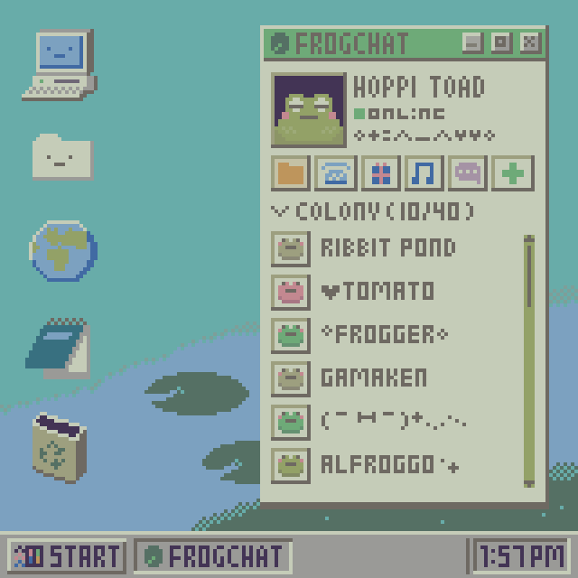

## ❄️ Socials

## ✏️ Facts 

- 🔥 I'm a computer science student at IFSP;
- I live in 🇧🇷 Brazil;
- 🌐 I like computer networks and understanding protocols;
- 🔨 I like to build my own networking tools (For example, [This](https://github.com/0x000b/gosnifp));
- I like creating Machine Learning models and studying them;
- 🐧 I'm a linux enthusiast;
- I'm interested in 
    - Cybersecurity
    - Machine Learning
    - Cryptography
    - Web Design
    - System Design
    - DNS
    - Web Development
    - Cli Apps

## 🚀 Techs

